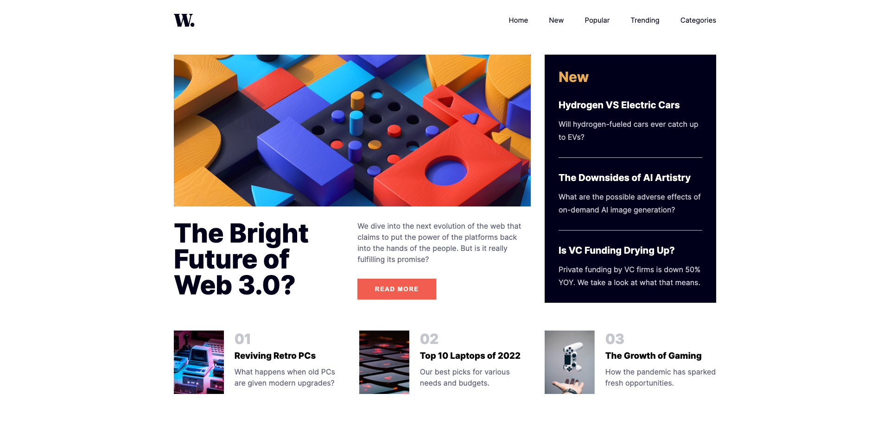
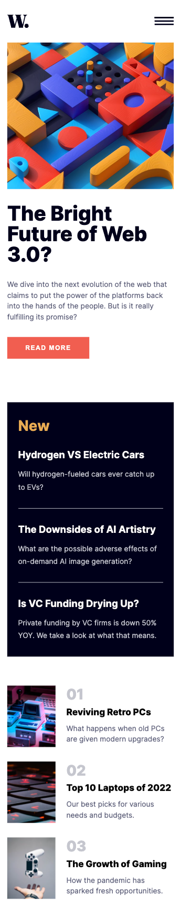
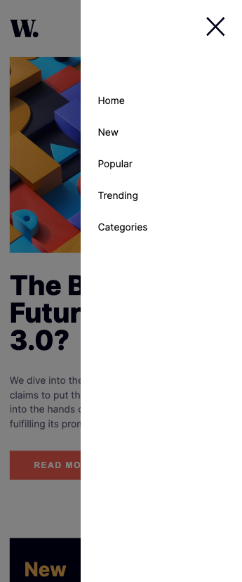

# Frontend Mentor - News homepage solution

This is a solution to the [News homepage challenge on Frontend Mentor](https://www.frontendmentor.io/challenges/news-homepage-H6SWTa1MFl). Frontend Mentor challenges help you improve your coding skills by building realistic projects.

## Table of contents

- [Frontend Mentor - News homepage solution](#frontend-mentor---news-homepage-solution)
  - [Table of contents](#table-of-contents)
  - [Overview](#overview)
    - [The challenge](#the-challenge)
    - [Screenshot](#screenshot)
    - [Links](#links)
  - [My process](#my-process)
    - [Built with](#built-with)
  - [Author](#author)

## Overview

### The challenge

Users should be able to:

- View the optimal layout for the interface depending on their device's screen size
- See hover and focus states for all interactive elements on the page

### Screenshot

Desktop  
 
Mobile  
 
Mobile Menu  
 

### Links

- Solution URL: [https://github.com/wongstephen/frontend-mentor-news-homepage](https://github.com/wongstephen/frontend-mentor-news-homepage)
- Live Site URL: [Live site URL](https://frontend-mentor-news-site-sw.netlify.app/)

## My process

I started my website build process with a mobile-first approach, designing the website for mobile devices first. Once I had the basic layout in place, I used CSS to style it and make it look more visually appealing.

Next, I created a desktop view for my website using CSS Grid to create a more complex layout that would look good on larger screens.

To make it easy for users to navigate my website on their mobile devices, I finished by creating a mobile menu component. I also used JavaScript event listeners to create interactivity, making my website more engaging and user-friendly.

Overall, my website build process focused on creating a responsive website that would look good and function well on all devices, from mobile phones to desktop computers. I used a combination of design and development techniques, including mobile-first design, CSS styling, and JavaScript interactivity.

### Built with

- Semantic HTML5 markup
- CSS custom properties
- Flexbox
- CSS Grid
- Mobile-first workflow

## Author

- Website - [Stephen Wong](https://www.wongstephenk.com)
- Frontend Mentor - [@yourusername](https://www.frontendmentor.io/profile/yourusername)
